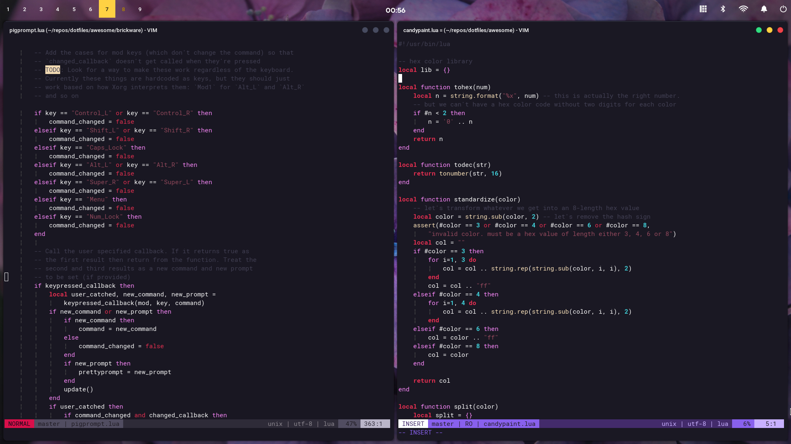

# Black Cherries
So dark it'll turn syntactic sugar into carbon


# Description
Official repository of the "black cherries" color scheme.
I hope you like it!


## Installation
* Take the file from the "colors" folder and put it into "~/.vim/colors/"
* then, in your ~/.vimrc file, add the following:
```
:colorscheme BlackCherries
set termguicolors
let &t_8f = "\<Esc>[38;2;%lu;%lu;%lum"  
let &t_8b = "\<Esc>[48;2;%lu;%lu;%lum"
```

And then things should be ok. If colors look way weird or something, it 
may be because you're using the 16-colors version of vim. If that's the
case, you may want to check this out [link](https://github.com/morhetz/gruvbox/wiki/Terminal-specific)

## License
[MIT/X11](https://opensource.org/licenses/MIT)
